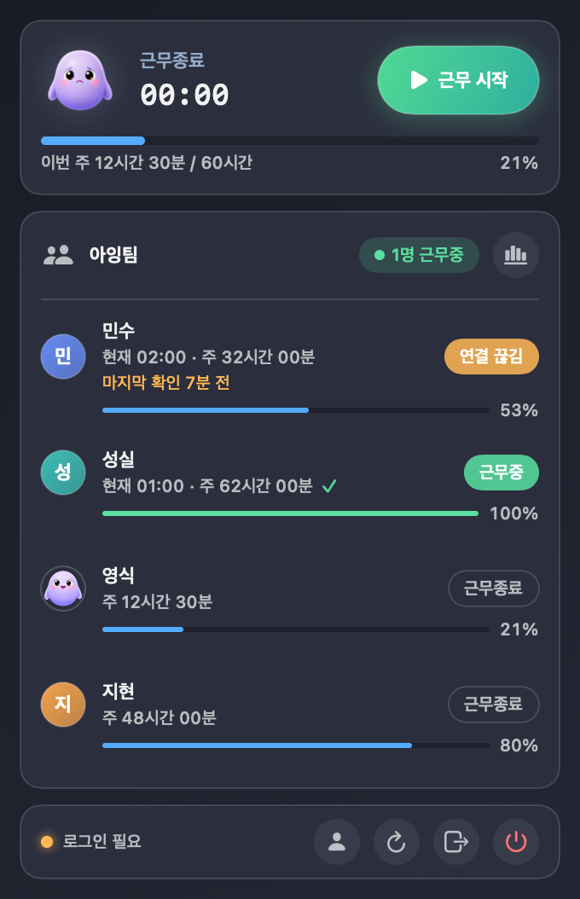

# aing-check

작은 Mac 팀을 위한 메뉴바 근무 타이머입니다. 상단바에서 근무 시작/종료를 누르면 팀 전체에 실시간으로 공유되고, 근무하는 동안 화면 구석에서 3D 캐릭터 "아잉"이 함께 일합니다.

<p align="center"></p>

## 기능

- **원클릭 근무 시작/종료** — 메뉴바에 오늘 누적 시간이 흐릅니다. 쉬었다 재개해도 0부터가 아니라 오늘 총합에서 이어집니다.
- **팀원 현황** — 누가 근무중인지, 현재/이번 주 근무시간, 그리고 각자의 주간 목표 진행 바. 목표는 팀 총합이 아니라 "각자 이번 주 이만큼은 하자"는 1인당 약속이고, 팀원 누구나 연필 버튼으로 조정할 수 있습니다. 참여코드도 팀원 누구나 열쇠 버튼으로 확인해 새 동료를 초대할 수 있습니다.
- **초대코드로 팀 참여** — 공개 팀 목록은 없습니다. 코드가 곧 열쇠입니다. 가입하면서 새 팀을 만들면 참여코드가 자동 발급됩니다.
- **팀별 이번 주** — 팀 규모가 달라도 공정하게, 1인당 평균 기준으로 팀들을 비교합니다.
- **캐릭터 오버레이** — 출퇴근 인사, 클릭하면 "아얏!", 마일스톤 색종이, 조용하면 눈을 감고 꾸벅 졸기. 쉬는 중에 컴퓨터를 5분쯤 쓰고 있으면 아잉이 "일하는 것 같아서 근무 시작했어요!" 하고 알리며 자동으로 근무를 시작합니다. 캐릭터 몸 위 클릭만 캐릭터가 받고 주변 여백은 뒤 창으로 통과돼 작업을 방해하지 않으며, 드래그로 위치를 옮길 수 있고(이동 방향을 바라보며 따라옵니다) 기억됩니다. 사람 아이콘 버튼으로 끌 수 있습니다.
- **AI 토큰 소모량** — 이 맥의 Claude Code/Codex 로컬 기록으로 이번 달 토큰 소모량을 집계해 보여 주고(매달 1일 리셋), 팀원별 순위 페이지에서 서로 비교할 수 있습니다(팀 내 공개).
- **가볍게** — 유휴 상태 실측 메모리 약 16MB · CPU 0%. 3D 렌더는 캐릭터를 표시할 때만 로드됩니다.

## 설치

```sh
brew install yehsung/check/aing-check
```

앱은 Apple 공증(notarized)이 되어 있어 경고 없이 바로 열립니다. 이후 업데이트는 `brew upgrade --cask aing-check`. (brew 가 없다면 [GitHub Releases](https://github.com/yehsung/check/releases)에서 `aing-check.zip`을 받아 풀고 앱을 응용 프로그램 폴더로 옮겨도 됩니다.)

처음이면 별명·이메일·비밀번호와 팀 코드로 가입하고(팀이 없으면 "새 팀 만들기"), 이후엔 근무 시작 버튼만 누르면 됩니다. 자세한 안내: [docs/team-install.md](docs/team-install.md)

## 문서

- [팀원 설치·사용 안내](docs/team-install.md)
- [배포·운영 가이드](docs/release.md) — 빌드, 공증, brew 릴리즈, Supabase 운영
- [프라이버시](docs/privacy.md) — 수집하는 것과 수집하지 않는 것

## 개발

Swift Package(SwiftUI `MenuBarExtra`) + Supabase(Auth/REST, RLS). 서버 스키마는 `supabase/migrations/`.

```sh
export CHECK_SUPABASE_ANON_KEY="<Supabase anon key>"   # 또는 .env.local (git 제외)
swift test                  # 전체 테스트
./scripts/build-local.sh    # → dist/aing-check.app
```
