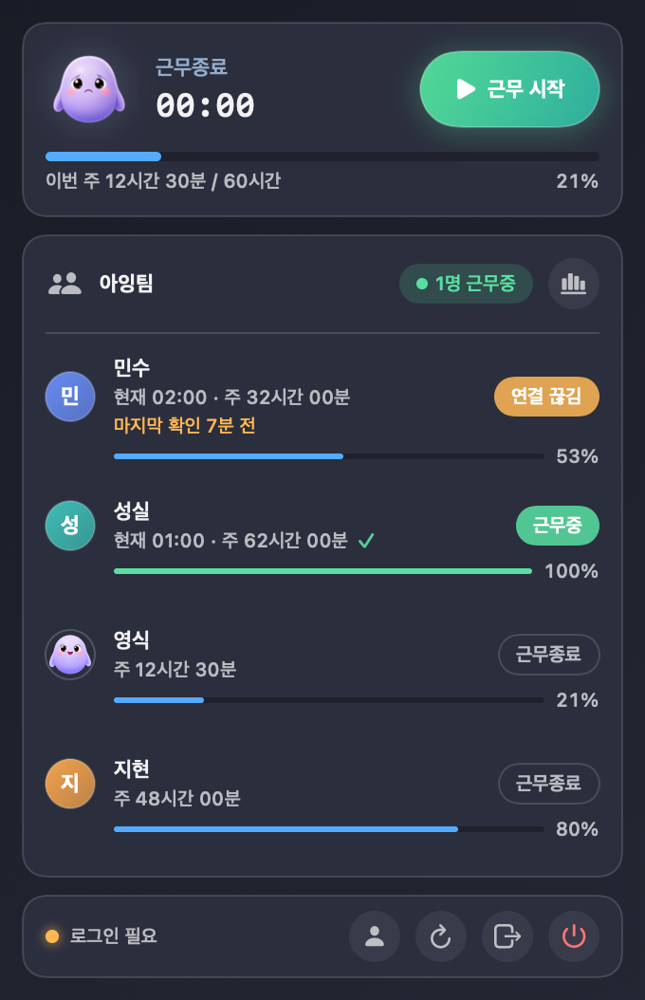

# aing-check

작은 Mac 팀을 위한 메뉴바 근무 타이머입니다. 상단바에서 근무 시작/종료를 누르면 팀 전체에 실시간으로 공유되고, 근무하는 동안 화면 구석에서 3D 캐릭터 "아잉"이 함께 일합니다.

<p align="center"></p>

## 기능

### 근무 기록

- **원클릭 근무 시작/종료** — 메뉴바에 오늘 누적 시간이 흐릅니다. 쉬었다 재개해도 0부터가 아니라 오늘 총합에서 이어집니다.
- **주간 목표 진행 바** — 내 근무 상자에서 이번 주 누적과 목표 대비 달성률을 함께 봅니다. 목표는 팀 총합이 아니라 "각자 이번 주 이만큼은 하자"는 1인당 약속이고, 팀원 누구나 연필 버튼으로 조정할 수 있습니다.
- **자동 근무 시작** — 쉬는 중에 컴퓨터를 계속 쓰고 있으면 아잉이 "일하는 것 같아서 근무 시작했어요!" 하고 알리며 근무를 대신 시작해 줍니다. 원하지 않으면 곧바로 뜨는 [취소]로 없던 일로 만들 수 있고, 내 근무 상자의 ⚡ 버튼으로 이 기능 자체를 꺼 둘 수도 있습니다.
- **깜빡 잊은 퇴근 정리** — 맥이 오래 잠들거나 앱이 한참 자리를 비운 채 남아 있던 근무는 마지막으로 확인된 시각으로 정리됩니다. 자리 비움으로 종료된 근무는 그 직후 잠깐 동안 팝오버에 뜨는 [되돌리기]로 다시 살릴 수 있습니다.
- **12시간 확인** — 12시간 넘게 근무 중이면 "아직 근무 중이신가요?" 하고 한 번 물어봅니다. [네, 근무 중이에요]로 이어 가거나 [지금 종료]로 그 자리에서 바로 퇴근할 수 있습니다.
- **끊겨도 괜찮게** — 인터넷이 잠깐 끊긴 동안 누른 시작/종료도 사라지지 않고, 연결이 돌아오면 누른 순서대로 반영됩니다.

### 팀과 함께

- **팀원 현황** — 누가 지금 근무중인지, 각자의 현재 근무 시간과 이번 주 누적, 그리고 각자의 주간 목표 진행 바를 한 화면에서 봅니다. 프로필 아바타는 각자 직접 고를 수 있습니다.
- **초대코드로 팀 참여** — 공개 팀 목록은 없습니다. 코드가 곧 열쇠입니다. 가입하면서 새 팀을 만들면 참여코드가 자동 발급되고, 팀원 누구나 열쇠 버튼으로 코드를 꺼내 새 동료를 초대할 수 있습니다.
- **팀별 이번 주** — 팀 규모가 달라도 공정하게, 1인당 평균 기준으로 팀들을 비교합니다.
- **콕 찌르기** — 앱을 쓰는 다른 사용자를 콕 찔러 알림을 보낼 수 있습니다. 찔린 사람의 캐릭터가 화들짝 놀라며 누가 찔렀는지 말풍선으로 알려 주고, 캐릭터를 숨겨 둔 사람에게도 잠깐 나타났다 사라집니다. 서로 근무 중일 때만 찌를 수 있고, 같은 사람을 연달아 찌를 수는 없습니다.

### 내 기록 돌아보기

- **근무 리듬 히트맵** — 최근 8주 동안 어떤 요일 어떤 시간대에 주로 일했는지 격자로 볼 수 있고, 가장 활발한 시간을 짚어 줍니다.
- **지난주 회고** — 지난주 총 근무시간, 목표 대비 달성 정도, 전주 대비 증감, 근무 세션 수, 가장 많이 일한 요일을 카드 한 장으로 정리합니다.
- **주가 바뀌면 한 번 안내** — 새 주가 시작되고 팝오버를 처음 열면 지난주 기록이 준비됐다는 안내가 한 번 뜹니다. [보기]를 누르면 곧바로 회고로 갑니다.
- 이 화면은 내 근무 기록만으로 만들어지며, 다른 팀원에게는 보이지 않습니다.

### AI 토큰 사용량

- **이번 달 소모량** — 이 맥의 Claude Code·Codex 로컬 기록으로 이번 달 토큰 소모량을 집계해 팝오버에 보여 줍니다. 매달 1일에 새로 시작합니다.
- **전체 순위판** — 앱을 쓰는 사용자들의 이번 달 소모량을 나란히 놓고 비교할 수 있습니다. 각자 오늘 얼마나 늘었는지도 함께 보이고, ‹ › 로 지난달과 그 이전 달 순위도 넘겨 볼 수 있습니다.
- **맥을 여러 대 써도** — 맥이 두 대 이상이면 각 맥에서 쓴 양이 합산되어 하나로 보입니다.
- **공개할지는 내가** — 순위판의 눈 버튼으로 내 사용량을 비공개로 바꿀 수 있습니다. 비공개로 두면 다른 사람의 순위판에서는 빠지고 내 순위판에서만 보입니다.

### 캐릭터 아잉

- **함께 일하는 캐릭터** — 근무하는 동안 화면 구석에 3D 캐릭터가 떠 있습니다. 출근하면 폴짝 뛰어오르고, 퇴근할 땐 꾸벅 인사하고 사라집니다.
- **리액션** — 클릭하면 "아얏!" 하고 반응합니다. 오늘 1시간·4시간을 넘기거나 주간 목표를 채우면 색종이가 터지고, 팀원이 근무를 시작하면 그 이름을 부르며 인사합니다. 한동안 조용하면 눈을 감고 꾸벅 졸다가 클릭하면 화들짝 깨어납니다.
- **작업을 방해하지 않게** — 캐릭터 몸 위 클릭만 캐릭터가 받고 주변 여백은 뒤 창으로 통과됩니다. 드래그로 위치를 옮길 수 있고(이동 방향을 바라보며 따라옵니다) 그 자리를 기억합니다. 사람 아이콘 버튼으로 아예 숨길 수도 있습니다.

### 안심하고 쓰기

- **업데이트 알림** — 새 버전이 나오면 팝오버 맨 위에 안내가 뜨고 [지금 업데이트] 한 번으로 설치까지 끝납니다. 여의치 않으면 [명령 복사]로 직접 실행할 수 있습니다. 캐릭터도 말풍선으로 한 번 알려 줍니다.
- **보지 않는 것** — 스크린샷, 키보드 입력, 마우스 움직임, 앱·웹사이트 사용 기록은 수집하지 않습니다. Accessibility·화면 기록·카메라·마이크·위치 권한도 요청하지 않습니다.
- **가볍게** — 메뉴바에 계속 띄워 두어도 부담이 없도록 만들었습니다. 3D 렌더는 캐릭터를 표시할 때만 켜집니다.

## 설치

```sh
brew install yehsung/check/aing-check
```

앱은 Apple 공증(notarized)이 되어 있어 경고 없이 바로 열립니다. 이후 업데이트는 `brew upgrade --cask aing-check`. (brew 가 없다면 [GitHub Releases](https://github.com/yehsung/check/releases)에서 `aing-check.zip`을 받아 풀고 앱을 응용 프로그램 폴더로 옮겨도 됩니다.)

처음이면 별명·이메일·비밀번호와 팀 코드로 가입하고(팀이 없으면 "새 팀 만들기"), 이후엔 근무 시작 버튼만 누르면 됩니다. 자세한 안내: [docs/team-install.md](docs/team-install.md)

## 문서

- [팀원 설치·사용 안내](docs/team-install.md)
- [배포·운영 가이드](docs/release.md) — 빌드, 공증, brew 릴리즈, Supabase 운영
- [프라이버시](docs/privacy.md) — 수집하는 것과 수집하지 않는 것

## 개발

Swift Package(SwiftUI `MenuBarExtra`) + Supabase(Auth/REST, RLS). 서버 스키마는 `supabase/migrations/`.

```sh
export CHECK_SUPABASE_ANON_KEY="<Supabase anon key>"   # 또는 .env.local (git 제외)
swift test                  # 전체 테스트
./scripts/build-local.sh    # → dist/aing-check.app
```
