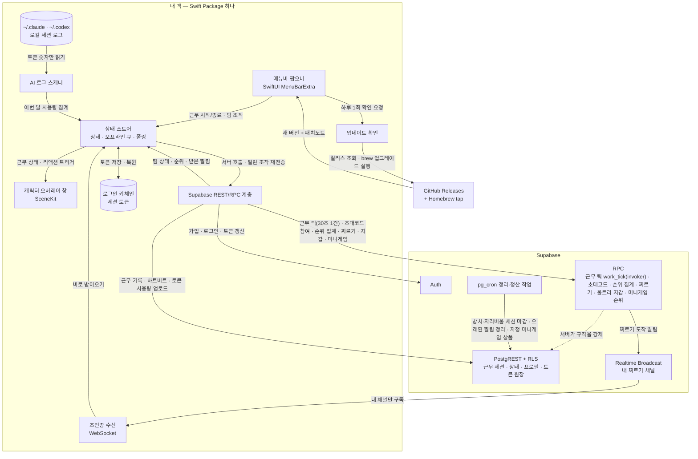

# aing-check

작은 Mac 팀을 위한 메뉴바 근무 타이머입니다. 상단바에서 근무 시작/종료를 누르면 팀 전체에 실시간으로 공유되고, 근무하는 동안 화면 구석에서 3D 캐릭터 "아잉"이 함께 일합니다.

출퇴근 카드나 근태 시스템을 들이기엔 작은 팀, 서로 지금 누가 일하고 있는지만 알면 되는 몇 명짜리 팀을 위해 만들었습니다. 메뉴바에 띄워 둔 채 버튼 하나로 쓰고, 근무 기록 위에 주간 목표와 지난주 회고, AI 토큰 사용량, 그리고 서로를 콕 찔러 부르는 장난을 얹었습니다. 의존성 없는 SwiftUI 네이티브 앱(macOS 14 이상)이고, 팀 데이터는 Supabase에 저장됩니다.

<p align="center"></p>

## 기능

### 근무 기록

- **원클릭 근무 시작/종료** — 메뉴바에 오늘 누적 시간이 흐릅니다. 쉬었다 재개해도 0부터가 아니라 오늘 총합에서 이어집니다.
- **주간 목표 진행 바** — 내 근무 상자에서 이번 주 누적과 목표 대비 달성률을 함께 봅니다. 목표는 팀 총합이 아니라 "각자 이번 주 이만큼은 하자"는 1인당 약속이고, 팀원 누구나 연필 버튼으로 조정할 수 있습니다.
- **자동 근무 시작** — 쉬는 중에 최근 10분 안에 5분 넘게 실제로 컴퓨터를 쓰고 있으면(키 입력·클릭·스크롤 기준, 마우스만 움직이는 건 세지 않습니다) 아잉이 "일하는 것 같아서 근무 시작했어요!" 하고 알리며 근무를 대신 시작해 줍니다. 캐릭터를 숨겨 뒀다면 메뉴바 아이콘이 근무중으로 바뀝니다. 켜고 끄는 설정은 없고, 원하지 않으면 근무 종료를 누르면 됩니다 — 직접 종료를 누른 뒤에는 한 시간 넘게 자리를 비웠다 돌아오기 전까지 다시 자동으로 시작하지 않습니다.
- **잠자기·끊김·자리비움 자동 마감** — 맥이 5분 넘게 잠들면(뚜껑을 닫으면) 덮은 시각으로, 신호가 10분 넘게 끊기면 마지막 신호 시각으로 근무가 정리됩니다. 키·클릭·스크롤이 2시간 30분 동안 한 번도 없으면 마지막으로 만진 시각으로 근무를 마감합니다. 어느 쪽이든 자리를 비운 뒤의 시간은 근무로 세지 않습니다.
- **잠깐 자리를 비운 것뿐이면 그냥 이어집니다** — 자동으로 마감된 근무는 돌아왔을 때 배너를 띄우지 않고 알아서 재개됩니다. 단 **되살아나는 시간은 30분까지**입니다(마감 시각 기준). 그보다 오래 비웠으면 그 시간은 근무가 아니므로 새로 시작해야 합니다. 예전에는 최대 6시간까지 되돌릴 수 있었는데, 실제로는 잠든 시간이 근무로 되살아나는 통로가 돼서(21일 동안 14건, 최대 289분) 상한이 묶인 자동 재개로 바꿨습니다.
- **12시간 확인** — 12시간 넘게 근무 중이면 "아직 근무 중이신가요?" 하고 한 번 물어봅니다. [네, 근무 중이에요]로 이어 가거나 [지금 종료]로 그 자리에서 바로 퇴근할 수 있고, 30분 안에 답이 없으면 12시간이 되던 시점으로 정리됩니다.
- **끊겨도 괜찮게** — 인터넷이 잠깐 끊긴 동안 누른 시작/종료도 사라지지 않고, 앱을 껐다 켜도 남아 있다가 연결이 돌아오면 누른 순서대로 반영됩니다.

### 팀과 함께

- **팀원 현황** — 누가 지금 근무중인지, 각자의 현재 근무 시간과 이번 주 누적, 그리고 각자의 주간 목표 진행 바를 한 화면에서 봅니다. 프로필 아바타는 각자 직접 고를 수 있습니다.
- **초대코드로 팀 참여** — 공개 팀 목록은 없습니다. 코드가 곧 열쇠입니다. 가입하면서 새 팀을 만들면 참여코드가 자동 발급되고, 팀원 누구나 열쇠 버튼으로 코드를 꺼내 새 동료를 초대할 수 있습니다.
- **팀 리그** — 앱을 쓰는 팀들을 나란히 놓고 1인당 평균 기준으로 비교합니다. 여기 오르는 것은 팀 이름·주간 목표·팀 합계 시간·근무 중 인원수·인원수와, 팀원이 모두 같은 센터일 때만 붙는 그 팀의 센터 표시뿐이고 개인별 숫자는 없습니다. 진행 중인 근무는 마지막 입력 후 30분까지만 합계에 오르므로, 자리를 비운 동안엔 순위가 올라가지 않습니다.
- **콕 찌르기** — 팀과 무관하게 같은 앱을 쓰는 누구든 콕 찔러 부를 수 있습니다. 목록에는 별명·아바타·소속 센터·지금 근무 중인지만 보입니다. 찔린 사람의 캐릭터가 화들짝 놀라며 누가 찔렀는지 말풍선으로 알려 주고, 캐릭터를 숨겨 둔 사람에게도 잠깐 나타났다 사라집니다. 서로 근무 중일 때만 찌를 수 있고, 같은 사람은 60초에 한 번입니다. 실시간 연결로 바로 도착하고, 연결이 흔들릴 땐 주기 확인이 뒤를 받칩니다.
- **3글자 메시지와 집중 모드** — 찌르기에 1~3글자 짧은 말을 실어 보낼 수 있습니다(5분 안에 전달되지 않으면 사라집니다). 찌르기 화면의 달 버튼으로 집중 모드를 켜 두면 남이 나를 찌르지 못합니다.
- **울트라** — 찌르기 버튼을 3초 꾹 누르면 울트라가 나가 상대 화면을 5초간 덮습니다. 울트라는 모아서 쓰는 재화입니다. 그날 누적 3시간마다 1개씩 받고(3시간·6시간·9시간…), 매일 최소 1개는 보장되며, 평소에는 최대 3개까지 이월됩니다. 가득 찬 상태에서 3시간을 채우면 그 몫은 사라지니 모아두기보다 쓰는 편이 이득입니다. 미니게임 상품으로 받은 10개는 예외적으로 상한을 넘겨 갖게 되는데, 그 초과분은 다음 자정에 3개로 정리되니 받은 날 쓰는 편이 좋습니다. 남은 개수는 찌르기 화면 배지에 늘 보이고, 배지를 누르면 충전 방법이 나옵니다.
- **소속 센터 표시** — 서울·부산 두 센터가 함께 쓰는 앱이라, 콕 찌르기 목록·AI 토큰 순위판·팀 리그·미니게임 순위에서 아바타 모서리에 "서울"/"부산" 글자가 겹쳐 붙습니다. 내 행과 우리 팀 행에도 붙고, 센터가 없는 계정과 센터가 섞인 팀에는 아무것도 그리지 않습니다. 갈라놓는 장치가 아니라 알아보는 표시입니다 — 순위·찌르기·메시지·미니게임은 지금처럼 앱을 쓰는 전원이 한 판에 섞이고, 센터로 나누는 필터나 탭은 없습니다. 센터는 가입할 때 고르고 설정 창에서 바꿉니다.

### 내 기록 돌아보기

- **근무 리듬 히트맵** — 지난주 한 주 동안 어떤 요일 어떤 시간대에 일했는지 격자로 볼 수 있고, 가장 활발했던 시간을 짚어 줍니다. 바로 아래 지난주 회고와 같은 주를 보여 주며, 칸이 진할수록 그 한 시간을 오래 채워 일했다는 뜻입니다.
- **지난주 회고** — 지난주 총 근무시간, 목표 대비 달성 정도, 전주 대비 증감, 근무 세션 수, 가장 많이 일한 요일을 카드 한 장으로 정리합니다.
- **주가 바뀌면 한 번 안내** — 새 주가 시작되고 팝오버를 처음 열면 지난주 기록이 준비됐다는 안내가 한 번 뜹니다. [보기]를 누르면 곧바로 회고로 갑니다.
- 이 화면은 내 근무 기록만으로 내 맥에서 계산되며, 팀 안팎 누구에게도 보이지 않습니다.

### AI 토큰 사용량

- **이번 달 소모량** — 이 맥의 Claude Code·Codex 로컬 기록으로 이번 달 토큰 소모량을 집계해 팝오버에 보여 줍니다. 매달 1일에 새로 시작합니다.
- **전체 순위판** — 팀이 아니라 앱을 쓰는 사용자 전체의 이번 달 소모량을 별명·아바타와 함께 나란히 놓고 비교합니다. 각자 오늘 얼마나 늘었는지도 함께 보이고, 제목 양옆 화살표로 지난달과 그 이전 달 순위도 넘겨 볼 수 있습니다.
- **맥을 여러 대 써도** — 맥이 두 대 이상이면 각 맥에서 쓴 양이 합산되어 하나로 보입니다.
- **Codex 는 계정 기준** — Codex 는 로컬 기록 대신 Codex 계정이 알려 주는 사용량을 씁니다. 계정 집계는 하루쯤 늦게 도착하므로, 아직 반영되지 않은 최근 하루만 로컬 기록으로 채웁니다. 계정 쪽 하루 경계는 오전 9시입니다(Claude 는 자정 기준). 로컬 기록은 예전 버전에서 대화를 갈래칠 때 부모 기록을 통째로 복사해 몇 배로 부풀던 문제가 있어, 0.2.43 이상에서 집계한 맥의 기록만 씁니다.
- **한 계정을 여럿이 쓰면 나눠 셉니다** — 같은 Codex 계정을 두 사람 이상이 쓰면 계정 사용량은 그 계정 전체의 값이라 누가 얼마나 썼는지 구분되지 않습니다. 그래서 각자의 로컬 기록 비율대로 나눠 갖습니다(두 사람 몫의 합은 계정 사용량과 정확히 같습니다).
- **공개할지는 내가** — 설정 창의 "AI 토큰 사용량 공개" 스위치로 비공개로 바꿀 수 있습니다. 비공개로 두면 다른 사람의 순위판에서는 빠지고 내 순위판에서만 "비공개" 표시와 함께 보입니다. 수집 자체를 멈추는 것은 운영자가 서버에서 처리합니다.

### 미니게임

- **타이밍 바 · 플래피 아잉** — 내 근무 상자의 게임패드 버튼을 누르면 **별도 창**이 떠서, 원하는 자리에 옮겨 놓고 합니다(왼쪽이 게임, 오른쪽이 오늘 순위). 타이밍 바는 움직이는 마커가 파란 구간에 들어올 때 클릭(10라운드, 최대 1,000점), 플래피 아잉은 클릭으로 점프해 기둥 사이를 지나갑니다. 클릭 대신 스페이스도 됩니다. 창 크기는 고정입니다 — 캔버스가 크면 게임이 쉬워져 순위가 실력이 아니라 창 크기로 갈리기 때문입니다. 창을 닫거나 다른 창으로 가면 판이 끝나고 게임은 아무것도 돌지 않습니다.
- **점점 어려워집니다** — 타이밍 바는 라운드가 갈수록 마커가 빨라지고 목표 구간이 좁아집니다. 구간 안에 들어오면 정중앙에 가까울수록 100점에서 70점까지, 빗나가면 0점입니다. 플래피 아잉은 점수가 오를수록 빨라지고 기둥 간격과 틈이 좁아지며, 15점을 넘으면 기둥 열 개 중 서너 개꼴로 틈 위치가 지나가는 도중 갑자기 한 번 튑니다.
- **오늘 순위와 자정 상품** — 순위는 그날(한국 시간) 최고 점수로 앱 사용자 전체가 나란히 섭니다. 매일 자정, 전날 게임별 1등에게 울트라 찌르기 10개를 상품으로 줍니다. 그날 그 게임을 **5명 이상**이 해야 상품이 나가고, 받은 10개는 보유 상한(3개)을 넘겨 갖지만 다음 자정에 3개로 정리됩니다.
- **공개할지는 내가** — 설정 창의 "미니게임 순위 공개" 스위치를 끄면 순위표에서 빠지고 점수도 올라가지 않습니다(최고기록은 이 맥에만 남습니다).

### 캐릭터 아잉

- **함께 일하는 캐릭터** — 근무하는 동안 화면 구석에 3D 캐릭터가 떠 있습니다. 출근하면 폴짝 뛰어오르고, 퇴근할 땐 꾸벅 인사하고 사라집니다.
- **리액션** — 클릭하면 "아얏!" 하고 반응합니다. 오늘 1시간·4시간을 넘기거나 주간 목표를 채우면 색종이가 터지고, 울트라를 새로 받으면 알려 주고, 팀원이 근무를 시작하면 그 이름을 부르며 인사합니다. 눈을 깜빡이고, 한동안 조용하면 눈을 감고 꾸벅 졸다가 클릭하면 화들짝 깨어납니다.
- **오늘 할 일 보드** — 캐릭터를 누르면 작은 할 일 목록이 열립니다. 이 목록은 내 맥에만 저장되고 서버로 가지 않으며, 못 끝낸 일은 다음날로 넘어옵니다. 보드의 진하기를 조절할 수 있고, 캐릭터 클릭으로 여는 동작은 설정에서 끌 수 있습니다.
- **작업을 방해하지 않게** — 캐릭터 몸 위 클릭만 캐릭터가 받고 주변 여백은 뒤 창으로 통과됩니다. 드래그로 위치를 옮길 수 있고(이동 방향을 바라보며 따라옵니다) 그 자리를 기억합니다. 사람 아이콘 버튼으로 아예 숨길 수도 있습니다.

### 안심하고 쓰기

- **업데이트 알림** — 새 버전이 나오면 팝오버 맨 위에 안내가 뜨고, 이번 버전에서 바뀐 내용도 몇 줄로 함께 보여 줍니다. [지금 업데이트] 한 번으로 설치까지 끝나고, 여의치 않으면 [명령 복사]로 직접 실행할 수 있습니다. brew 로 업그레이드하면 앱이 저절로 다시 켜집니다. 캐릭터도 말풍선으로 한 번 알려 줍니다.
- **로그인 정보** — 비밀번호는 저장하지 않고, 로그인 세션 토큰은 macOS 로그인 키체인에 보관합니다. 비밀번호를 잊으면 메일로 받은 6자리 코드로 다시 정할 수 있습니다.
- **설정 창** — 로그인 시 자동 실행(맥을 켜면 앱이 저절로 뜹니다), 캐릭터 클릭으로 할 일 열기, AI 토큰 사용량 공개, 미니게임 순위 공개, 별명 바꾸기(일주일에 한 번), 소속 센터 바꾸기를 한곳에서 다룹니다.
- **보지 않는 것** — 스크린샷, 키보드 입력, 마우스 움직임, 앱·웹사이트 사용 기록은 수집하지 않습니다. Accessibility·화면 기록·카메라·마이크·위치 권한도 요청하지 않습니다. 근무 중에만 "마지막으로 키·클릭·스크롤을 한 시각" 하나를 30초에 한 번까지 서버에 보내 자리 비움 판정과 순위 반영에 씁니다 — 무엇을 입력했는지는 담기지 않습니다.
- **누가 무엇을 보나** — 내 근무 시작/종료 시각·근무 시간·근무 기록은 같은 팀 안에서만 보입니다. 콕 찌르기 대상 목록·AI 토큰 순위판·미니게임 순위표는 팀 단위가 아니라 같은 앱을 쓰는 모든 사용자가 서로 보는 화면이고, 거기 보이는 것에는 별명·아바타와 함께 소속 센터(서울/부산) 표시도 들어갑니다. 자세한 범위는 [프라이버시 문서](docs/privacy.md)에 있는 그대로 적었습니다.
- **가볍게** — 3D 렌더는 캐릭터가 실제로 보일 때만 돕니다. 숨겨 두거나 화면이 꺼지거나 잠기면 멈추고, 쉬는 동안엔 낮은 프레임으로 돕니다. 팝오버를 닫아 두면 초 단위 화면 갱신과 순위판·찌르기 목록 조회도 멈추고, 토큰 사용량 캐시는 이번 달치 위주로 가볍게 들고 있습니다. 근무 중 30초마다 나가던 통신도 줄였고 — 생존신호·팀 상태·자리비움 확인 등 7~8건을 서버 함수 `work_tick` 한 번으로 합쳐 보내되 내용은 그대로이고, 그 함수가 없는 서버에서는 예전 방식으로 조용히 되돌아갑니다 — 잠에서 깨어날 땐 네트워크가 붙은 뒤에 통신을 다시 시작합니다.

## 구조


```mermaid
flowchart TD
    subgraph mac["내 맥 — Swift Package 하나"]
        menu["메뉴바 팝오버<br/>SwiftUI MenuBarExtra"]
        overlay["캐릭터 오버레이 창<br/>SceneKit"]
        store["상태 스토어<br/>상태 · 오프라인 큐 · 폴링"]
        rest["Supabase REST/RPC 계층"]
        ring["초인종 수신<br/>WebSocket"]
        scanner["AI 로그 스캐너"]
        logs[("~/.claude · ~/.codex<br/>로컬 세션 로그")]
        keychain[("로그인 키체인<br/>세션 토큰")]
        updater["업데이트 확인"]
    end

    subgraph sb["Supabase"]
        auth["Auth"]
        db["PostgREST + RLS<br/>근무 세션 · 상태 · 프로필 · 토큰 원장"]
        rpc["RPC<br/>근무 틱 work_tick(invoker) · 초대코드 · 순위 집계 · 찌르기 · 울트라 지갑 · 미니게임 순위"]
        realtime["Realtime Broadcast<br/>내 찌르기 채널"]
        cron["pg_cron 정리·정산 작업"]
    end

    gh["GitHub Releases<br/>+ Homebrew tap"]

    menu -->|"근무 시작/종료 · 팀 조작"| store
    store -->|"근무 상태 · 리액션 트리거"| overlay
    logs -->|"토큰 숫자만 읽기"| scanner
    scanner -->|"이번 달 사용량 집계"| store
    store <-->|"토큰 저장 · 복원"| keychain

    store -->|"서버 호출 · 밀린 조작 재전송"| rest
    rest -->|"팀 상태 · 순위 · 받은 찔림"| store
    rest -->|"가입 · 로그인 · 토큰 갱신"| auth
    rest -->|"근무 기록 · 하트비트 · 토큰 사용량 업로드"| db
    rest -->|"근무 틱(30초 1건) · 초대코드 참여 · 순위 집계 · 찌르기 · 지갑 · 미니게임"| rpc
    rpc -.->|"서버가 규칙을 강제"| db
    rpc -->|"찌르기 도착 알림"| realtime
    realtime -->|"내 채널만 구독"| ring
    ring -->|"바로 받아오기"| store
    cron -->|"방치·자리비움 세션 마감 · 오래된 찔림 정리 · 자정 미니게임 상품"| db

    menu -->|"하루 1회 확인 요청"| updater
    updater -->|"릴리스 조회 · brew 업그레이드 실행"| gh
    gh -->|"새 버전 + 패치노트"| menu
```

클라이언트는 Swift Package 하나이고, 화면에 필요한 상태는 `@Observable` 스토어 한 곳에 모입니다. 팝오버와 캐릭터 오버레이는 같은 스토어를 읽는 두 개의 표시 표면일 뿐이라, 근무 상태가 두 벌로 갈라지지 않습니다. 서버 접근은 REST/RPC 한 계층만 통과하고, 오프라인에서 누른 시작/종료는 그 계층 앞의 큐에 쌓였다가(앱을 껐다 켜도 남습니다) 순서대로 재전송됩니다. 찌르기 수신만은 별도의 WebSocket 초인종이 맡고, 소켓이 조용히 죽는 경우를 대비해 주기 확인이 뒤를 받칩니다.

내 소유 행(근무 세션·상태·프로필·토큰 원장)은 PostgREST로 직접 읽고 쓰되 RLS가 경계를 지키고, 남의 데이터가 섞이거나 규칙을 강제해야 하는 일 — 초대코드로 팀 참여, 팀·토큰 순위 집계, 찌르기 조건과 쿨타임, 울트라 잔량과 미션 적립, 미니게임 순위와 자정 상품 — 은 전부 `security definer` RPC를 거칩니다. 팀·소속·찌르기 테이블에는 아예 쓰기 정책이 없어 RPC 경유가 구조적으로 강제됩니다. 근무 기록의 시각과 시간은 서버가 다시 검증하고(미래 시각·역전은 눌러 펴고, 근무 시간은 서버가 재계산), 순위 집계는 겹치는 구간을 한 번만 셉니다. 앱을 켜 두지 않아도 되는 일(방치·자리비움 세션 마감, 오래된 찔림 삭제, 자정 미니게임 상품 지급과 울트라 상한 정리)은 pg_cron이 주기로 돌립니다. 미니게임 점수는 클라이언트가 보내지만 서버가 내려쓰기를 막고(최고 점수만 올라갑니다) 게임별 상한을 넘는 값을 거부합니다.

AI 토큰 사용량만은 서버가 알 수 없는 값이라, 각자의 맥에서 로컬 세션 로그를 증분 스캔해 숫자만 집계한 뒤 월별·일별 원장에 올립니다. 대화 내용이나 파일 경로는 읽지도 보관하지도 않습니다. Codex 는 로컬 로그가 갈래친 대화를 중복해 세는 문제가 있어, 앱이 로컬 `codex` 에게 계정 사용량을 물어 그 값을 기준으로 삼고 아직 반영되지 않은 최근 하루만 로컬로 채웁니다. 한 계정을 여러 사람이 쓰면 서버가 그 사실을 계정 누적값으로 알아채 각자의 로컬 비율대로 나눕니다.

| 경로 | 역할 |
| --- | --- |
| `Sources/check/` | 앱 전부 — 팝오버 UI, 캐릭터 오버레이, 할 일 보드, 상태 스토어, Supabase 계층, 초인종 소켓, 토큰 스캐너, 3D·이미지 리소스 |
| `Tests/checkTests/` | 단위 테스트, 팝오버 렌더 스냅샷, 옵트인 라이브 e2e |
| `supabase/migrations/` | 테이블·RLS 정책·RPC·cron 잡 스키마 |
| `scripts/` | 로컬 빌드, 서명·공증 패키징, brew 릴리스, 캐릭터 프리베이크 |
| `packaging/` | 앱 아이콘과 Homebrew cask 정의 |
| `docs/` | 설치·배포·프라이버시 문서, 서버 계약 문서(자리비움·울트라·근무 틱), 이미지 |

서버에 저장되는 것은 근무 기록·팀·프로필·토큰 집계·찌르기 기록(7일 뒤 삭제)·미니게임 일별 최고기록과 상품 지급 기록·버그와 요청사항 제보(본인과 운영자만 보고, 계정을 지우면 작성자 연결만 끊습니다)이고, 로그인 세션 토큰은 macOS 로그인 키체인에, 화면 설정(캐릭터 위치·표시 여부 등)·할 일 목록·토큰 스캔 캐시는 이 맥에만 남습니다.

## 설치

```sh
brew install yehsung/check/aing-check
```

앱은 Apple 공증(notarized)이 되어 있어 경고 없이 바로 열립니다. 이후 업데이트는 `brew update && brew upgrade --cask aing-check` — 업그레이드가 끝나면 앱이 저절로 다시 켜집니다. (brew 가 없다면 [GitHub Releases](https://github.com/yehsung/check/releases)에서 `aing-check.zip`을 받아 풀고 앱을 응용 프로그램 폴더로 옮겨도 됩니다.)

처음이면 별명·이메일·비밀번호와 소속 센터(서울/부산), 팀 코드로 가입하고(팀이 없으면 "새 팀 만들기"), 이후엔 근무 시작 버튼만 누르면 됩니다. 앱은 로그인 시 자동으로 실행되도록 등록되며 설정 창에서 끌 수 있습니다. 자세한 안내: [docs/team-install.md](docs/team-install.md)

## 개발

Swift Package(SwiftUI `MenuBarExtra`) + Supabase(Auth/REST/Realtime, RLS). 서버 스키마는 `supabase/migrations/`.

```sh
export CHECK_SUPABASE_ANON_KEY="<Supabase 공개용 키>"   # 또는 .env.local (git 제외)
swift test                  # 전체 테스트
./scripts/build-local.sh    # → dist/aing-check.app
```

테스트는 세 종류입니다. 순수 로직 단위 테스트(집계·포매팅·동기화 상태 전이)와, 팝오버를 `ImageRenderer`로 그려 레이아웃과 창 높이 상한을 지키는지 확인하는 렌더 스냅샷 테스트가 기본으로 돌고, 실제 Supabase 프로젝트를 상대로 하는 라이브 e2e 테스트는 `CHECK_E2E=1`과 키 파일을 줄 때만 켜집니다.

릴리스는 `CHANGELOG.md`에 이번 버전 내용을 먼저 적고 — 그 내용이 GitHub 릴리스 노트가 되고 앱 안 업데이트 배너의 패치노트로도 쓰입니다 — 새 마이그레이션이 있으면 앱보다 먼저 서버에 적용한 뒤, 빌드·서명·공증을 거쳐 GitHub Release와 Homebrew tap을 갱신하는 순서입니다. 명령과 운영 주의사항(스키마 적용 후 기존 조회 확인, RPC 실행권 점검, 무료 플랜 일시정지 복원)은 [docs/release.md](docs/release.md)에 있습니다.

## 문서

- [팀원 설치·사용 안내](docs/team-install.md)
- [배포·운영 가이드](docs/release.md) — 빌드, 공증, brew 릴리즈, Supabase 운영
- [프라이버시](docs/privacy.md) — 수집하는 것과 수집하지 않는 것, 누가 무엇을 볼 수 있나
- 서버 계약(운영자용) — [자리비움 자동 마감·복원](docs/away-close.md), [울트라 재화·미션·초인종](docs/ultra-economy.md), [근무 틱 통합 RPC](docs/work-tick.md)
- [변경 이력](CHANGELOG.md)
